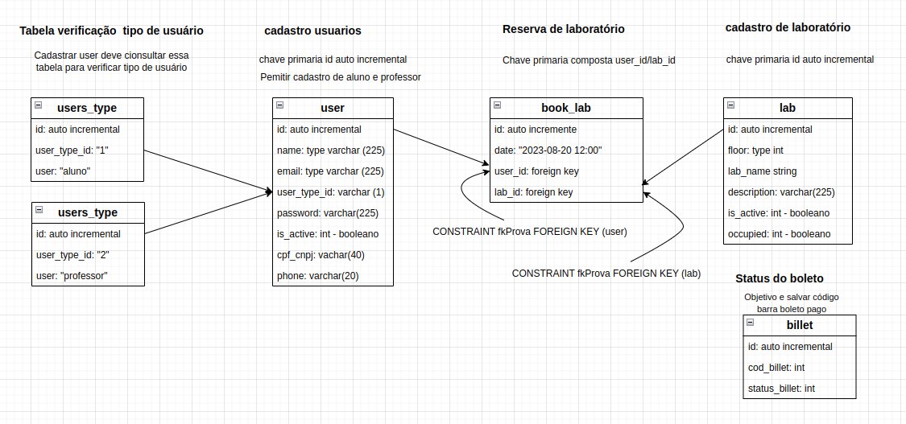

Instalar dependências para rodar projeto:
* Express / node_modules  
`npm install express`  

* Sequelize e driver para mysql  
`npm install sequelize mysql2`  

* Instalar dependência bcrypt   
`npm install --save bcrypt` 

* Instalar dependência JWT  
`npm install --save jsonwebtoken`

### Banco de dados   
* Tabelas a serem criadas:  
|
